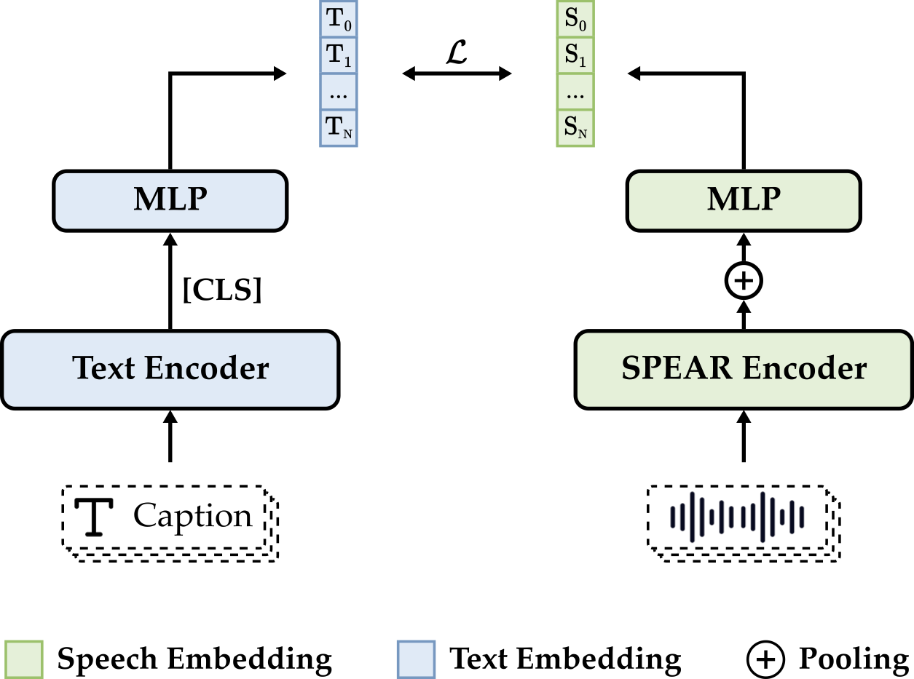

# CLSP: Contrastive Language–Speech Pretraining

<div align="center">
    <p>
    
    </p>
    <p>
    </p>
    <a href="https://arxiv.org/abs/2601.03065"></a>
    <a href="https://huggingface.co/yfyeung/CLSP"></a>
    <a href="https://huggingface.co/datasets/yfyeung/FCaps"></a>
    <a href="https://github.com/yfyeung/CLSP"></a>
    <p>
    Official code for <em>Towards Fine-Grained and Multi-Granular Contrastive Language-Speech Pre-training</em>
    </p>
</div>

**CLSP (pronounced /klɪsp/)** is a contrastive language–speech pretraining model that integrates global and fine-grained supervision to learn unified representations across multiple granularities. It performs reliably across global and fine-grained speech-text retrieval, zero-shot paralinguistic classification, and speech style similarity scoring, with strong alignment to human judgments.

## CLSP Model

[🤗Hugging Face](https://huggingface.co/yfyeung/CLSP)

### Architecture

CLSP adopts a dual-encoder architecture, where speech and text are processed by separate encoders and projected into a shared embedding space.



### Usage: Extract Features

With CLSP, you can extract a latent representation of any given audio and text.

```python
import torch
import torchaudio
from transformers import AutoModel

model = AutoModel.from_pretrained(
    "yfyeung/CLSP",
    trust_remote_code=True,
)
if torch.cuda.is_available():
    model = model.to("cuda")

device = next(model.parameters()).device

audio_path = "assets/00099.wav"
audio, sr = torchaudio.load(audio_path)
if sr != 16000:
    audio = torchaudio.functional.resample(audio, sr, 16000)
    sr = 16000
audio = audio.to(device)
audio_lens = torch.tensor([audio.size(1)], device=device)

text = [
    "A female speaker with a medium-pitched British accent.",
    "A male speaker with a medium-pitched British accent.",
    "A female speaker delivers her enunciated words rapidly in a medium-pitched British accent, conveying an authoritative tone.",
    "A female speaker delivers her enunciated words slowly in a medium-pitched Chinese accent, conveying an authoritative tone.",
    "A mature female with a clear, medium-pitched voice and a British accent speaks in a formal, presentational style, characteristic of a newsreader or broadcaster. She delivers her speech at a fast pace with deliberate enunciation and a measured, authoritative rhythm. Her tone remains neutral and informative, with subtle emphasis on specific phrases, and her volume is consistently loud and steady. The delivery is fluent and controlled.",
]

with torch.no_grad():
    audio_embedding, text_embedding, _ = model(audio, audio_lens, text)

print(audio_embedding)
print(text_embedding)
```

### Usage: Speech-Text Retrieval

With CLSP, you can perform global and fine-grained speech–text retrieval.

```python
import torch
import torchaudio
from transformers import AutoModel

model = AutoModel.from_pretrained(
    "yfyeung/CLSP",
    trust_remote_code=True,
)
if torch.cuda.is_available():
    model = model.to("cuda")

device = next(model.parameters()).device

audio_paths = [
    "assets/ex04-ex02_laughing_004_channel1_segment_146.92_151.77.wav",
    "assets/ex03_enunciated_00012.wav",
    "assets/ex04-ex02_sarcastic_001_channel2_segment_96.55_102.12.wav",
    "assets/ex04-ex02_desire_002_channel2_segment_288.26_291.65.wav",
    "assets/ex01_laughing_00196.wav",
    "assets/ex03-ex01_happy_005_channel2_segment_17.22_19.69.wav",
    "assets/ex03-ex01_awe_001_channel2_segment_368.42_373.69.wav",
    "assets/ex04-ex03_whisper_003_channel1_segment_26.55_34.17.wav",
    "assets/ex04-ex02_disgusted_012_channel1_segment_255.9_258.18.wav",
    "assets/ex03_laughing_00051.wav",
]
audio_list = []
audio_lens = []
for audio_path in audio_paths:
    audio, sr = torchaudio.load(audio_path)
    if sr != 16000:
        audio = torchaudio.functional.resample(audio, sr, 16000)
        sr = 16000
    audio_list.append(audio.squeeze(0))
    audio_lens.append(audio.size(1))
audio = torch.nn.utils.rnn.pad_sequence(audio_list, batch_first=True).to(device)
audio_lens = torch.tensor(audio_lens, device=device)
with torch.no_grad():
    audio_features, _, _ = model(audio=audio, audio_lens=audio_lens)

# global speech-text retrieval
texts = [
    "A female American speaker's animated, high-pitched, and shrill voice is crisp and enunciated, yet recorded in a very noisy environment. Her speech is booming, loud, and interspersed with bouts of laughter. Despite the slow speed of her delivery, she expresses herself clearly and with great expressiveness.",
    "A male speaker with an American accent delivers a singing-song voice, nasal in tone, in a very clean and quiet environment. His speech is flowing, enunciated clearly, and characterized by a high-pitched tone, imparting a sense of authority.",
    "A female speaker with an American accent delivers a singsong, sarcastic, and loud speech with a high-pitched voice and measured speed. Her words are clear and crisp, produced in a very clean environment. The silky texture of her voice adds to the overall pleasant listening experience.",
    "In a very clean environment, a female speaker delivers a silky, singsong, crisp, and high-pitched speech with an animated and desirous tone, expressing herself at a measured speed with distinct clarity, characteristic of an American accent, and concluding with a loud volume.",
    "In a slightly noisy environment, a male speaker delivers an animated, laughing performance at a slow, flowing pace, employing a high-pitched, singsong American accent.",
    "A male speaker delivers a singing, animated, and happy speech with a high-pitched voice and a measured speed in a clean environment. His tone flows smoothly and displays an upbeat, singsong rhythm characteristic of American English.",
    "An American male speaks in a measured speed with a high-pitched tone, expressing awe in a flowing, singsong manner in a very clean environment.",
    "A female speaker delivers a whispered, high-pitched voice amidst a very noisy environment. Her speech is crisp and enunciated, yet contrastingly, she occasionally adopts a booming, American tone with a measured speed. The booming segments are loud and clear, while the high-pitched whispers are shrill and difficult to discern.",
    "A female speaker delivers a high-pitched, crisp, enunciated, and loud American accent in a very clean environment. Her speech is slow in speed yet booming and expresses a sense of disgust, resulting in a shrill and intense tone.",
    "A male speaker with a nasal twang delivers an animated, authoritative, and singsong speech in a clean American environment. His voice is high-pitched and moves at a slow speed, punctuated by occasional laughter.",
]
with torch.no_grad():
    _, text_features, _ = model(text=texts)
    logits_per_audio = torch.matmul(audio_features, text_features.t()).cpu()
    logits_per_text = logits_per_audio.t()
    for name, logit in {
        "audio_to_text": logits_per_audio,
        "text_to_audio": logits_per_text,
    }.items():
        ranking = torch.argsort(logit, dim=1, descending=True)
        ranks = torch.empty_like(ranking)
        ranks.scatter_(1, ranking, torch.arange(10).unsqueeze(0).expand(10, -1))
        idx = torch.arange(10)
        preds = ranks[idx, idx]
        print(f"{name}_ranks = {ranking.tolist()}")
        for k in [1, 5, 10]:
            print(f"{name}_R@{k} = {(preds < k).float().mean().item()}")
        print(
            f"{name}_mAP@10 = {torch.where(preds < 10, 1.0 / (preds.float() + 1.0), torch.zeros_like(preds, dtype=torch.float)).mean().item()}"
        )

# fine-grained speech-text retrieval
texts = [
    "A female speaker with a clear, medium-high pitched voice and an American accent speaks in a conversational, informal style. She begins at a slow, deliberate pace, her tone gentle and tinged with amusement. Her speech is animated and expressive, with fluctuating pitch that rises with laughter. She delivers a short phrase, then breaks into a soft, breathy chuckle that continues into the next segment. The chuckle is light and airy, conveying genuine amusement as she speaks. The rhythm is unhurried, with natural pauses and breaths, and the overall emotional tone remains playful and lightly mocking, ending with a sustained, melodic chuckle.",
    "A male speaker with a deep, resonant, and gravelly voice, characteristic of a mature adult, delivers a single, clear phrase. His speech is marked by a slow and deliberate pace, with each syllable distinctly separated. The articulation is exceptionally clear, with a high degree of enunciation, and the pitch remains steady throughout. The voice carries a slightly raspy texture and a low-to-mid frequency, producing a gravelly, sonorous effect. The delivery is smooth and unhurried, with a calm and relaxed tone that conveys a sense of casual authority, as if speaking gently but with confidence.",
    'A young adult female with a clear, medium-high pitched voice and an American accent speaks in a casual, conversational style. She begins with a moderate, measured speed, using a rising intonation that conveys sarcasm and mild exasperation. Her tone is expressive and fluctuating, especially on the phrase "like oh," where she uses a high pitch and a drawn-out delivery to mock the situation. After a brief pause, she continues at a similar measured pace, maintaining an expressive, slightly descending intonation. The overall volume remains moderate and consistent, with a clear, articulate delivery throughout the fluent speech.',
    'A young female speaker with a clear, medium-high pitched voice and an American accent speaks in a calm, gentle, and measured pace. Her tone is soft and breathy, conveying a sense of contentment and admiration. She begins with a thoughtful, drawn-out "hmm," which is delivered slowly with a gentle rise and fall in pitch. Immediately following, her voice becomes slightly brighter and more animated as she expresses her appreciation, using a moderately loud volume and a warm, expressive intonation. The speech flows smoothly, with a natural cadence and a subtle emotional warmth that suggests genuine enjoyment.',
    "A male speaker with a clear, medium-pitched voice and an American accent delivers a slow, expressive monologue. He begins with a gentle, high-pitched laugh that conveys amusement and warmth. As he speaks, his voice remains animated and fluctuates in pitch, with a soft, breathy quality. He maintains a slow speaking rate, with deliberate pauses between phrases and a natural rhythm, particularly after the initial laugh. His tone is consistently lively and engaged, emphasizing certain words with increased pitch and volume, especially when referencing a “great math team.” Throughout, his voice carries a friendly and inviting emotional character, reflecting personal pride and fondness.",
    "A male speaker with a clear, medium-pitched voice and a standard American accent delivers a friendly, conversational phrase at a measured speed. His tone is animated and happy, conveying an inquisitive and playful mood. He speaks with a moderate pace and a friendly, expressive intonation, pausing briefly before a sharp, high-pitched gasp that expresses surprise or excitement, followed by a short, breathy, and slightly muffled exclamation. The overall delivery is lively and engaging, suggesting an informal and upbeat context.",
    'A male speaker with a medium-low pitched, clear, and resonant voice delivers his words at a measured, slow speed. His tone is calm and contemplative, conveying a sense of awe and wonder as he speaks. The intonation is gentle and soft, with a subtle rise in pitch on certain words, such as "light pollution" and "human life," which adds to the reflective and awed quality of his speech. The speaker\'s delivery is smooth and fluid, with a slight breath intake between phrases, and he maintains a steady, moderate volume throughout.',
    "A young female with a clear, medium-pitched voice and an American accent speaks in a measured, deliberate speed. Her tone is soft, gentle, and intimate, with a conversational, informal style. The speech is delivered in a whispered manner, characterized by a low volume and a breathy texture, conveying a sense of closeness and calm. She begins with a brief, low-pitched inhale, followed by a slightly higher-pitched exhale, and uses subtle variations in pitch and emphasis to express enthusiasm. The delivery remains consistently soft and breathy, with a gentle rise and fall in intonation that maintains a natural, unhurried flow throughout the recording.",
    "A young adult female with a clear, medium-high pitched voice and an American accent delivers her words at a slow and deliberate pace. Her tone is casual and conversational, carrying a subtle undercurrent of disgust and mild disapproval. She speaks with a consistent, moderate volume, using a slightly descending intonation that emphasizes her sense of distaste. The delivery is fluid and natural, with each word articulated distinctly and a brief, audible inhale preceding the final word.",
    "A male speaker with a medium-pitched, clear voice and an American accent delivers the opening phrase at a slow, deliberate pace. His tone is animated and expressive, beginning with a brief, high-pitched laugh that conveys amusement. The phrase is spoken with a rising inflection, giving it a questioning and playful quality. After a short pause, the speaker transitions to a second phrase, which is delivered at a noticeably faster, more energetic pace, marked by a sharp, emphatic intonation and a pronounced downward inflection on the final word. The overall impression is one of lively, performative speech, suggesting a comedic or dramatic context.",
]
with torch.no_grad():
    _, text_features, _ = model(text=texts)
    logits_per_audio = torch.matmul(audio_features, text_features.t()).cpu()
    logits_per_text = logits_per_audio.t()
    for name, logit in {
        "audio_to_text": logits_per_audio,
        "text_to_audio": logits_per_text,
    }.items():
        ranking = torch.argsort(logit, dim=1, descending=True)
        ranks = torch.empty_like(ranking)
        ranks.scatter_(1, ranking, torch.arange(10).unsqueeze(0).expand(10, -1))
        idx = torch.arange(10)
        preds = ranks[idx, idx]
        print(f"{name}_ranks = {ranking.tolist()}")
        for k in [1, 5, 10]:
            print(f"{name}_R@{k} = {(preds < k).float().mean().item()}")
        print(
            f"{name}_mAP@10 = {torch.where(preds < 10, 1.0 / (preds.float() + 1.0), torch.zeros_like(preds, dtype=torch.float)).mean().item()}"
        )
```

### Usage: Zero-shot Paralinguistic Classification

With CLSP, you can recognize paralinguistic attributes (e.g., emotion, gender, age) under diverse attribute sets, without any task-specific training.

```python
import torch
import torchaudio
from transformers import AutoModel

model = AutoModel.from_pretrained(
    "yfyeung/CLSP",
    trust_remote_code=True,
)
if torch.cuda.is_available():
    model = model.to("cuda")

device = next(model.parameters()).device

audio_path = "assets/00099.wav"
audio, sr = torchaudio.load(audio_path)
if sr != 16000:
    audio = torchaudio.functional.resample(audio, sr, 16000)
    sr = 16000
audio = audio.to(device)
audio_lens = torch.tensor([audio.size(1)], device=device)

# emotion
prompts = [
    "A speaker in a happy tone.",
    "A speaker in a angry tone.",
    "A speaker in a sad tone.",
    "A speaker in a neutral tone.",
]
with torch.no_grad():
    _, text_features, _ = model(text=prompts)
    audio_features, _, _ = model(audio=audio, audio_lens=audio_lens)
    logits_per_audio = torch.matmul(audio_features, text_features.t())
    preds = logits_per_audio.argmax(dim=1)
print(prompts[preds.item()])

# gender
prompts = [
    "A male speaker.",
    "A female speaker.",
]
with torch.no_grad():
    _, text_features, _ = model(text=prompts)
    audio_features, _, _ = model(audio=audio, audio_lens=audio_lens)
    logits_per_audio = torch.matmul(audio_features, text_features.t())
    preds = logits_per_audio.argmax(dim=1)
print(prompts[preds.item()])

# age
prompts = [
    "A child or young teenager speaker.",
    "An adult speaker.",
    "A middle-aged speaker.",
    "An older or elder speaker.",
]
with torch.no_grad():
    _, text_features, _ = model(text=prompts)
    audio_features, _, _ = model(audio=audio, audio_lens=audio_lens)
    logits_per_audio = torch.matmul(audio_features, text_features.t())
    preds = logits_per_audio.argmax(dim=1)
print(prompts[preds.item()])
```

### Usage: Speech Style Similarity Scoring

With CLSP, you can score speech style similarity that shows strong alignment with human judgments.

```python
import torch
import torchaudio
from transformers import AutoModel

model = AutoModel.from_pretrained(
    "yfyeung/CLSP",
    trust_remote_code=True,
)
if torch.cuda.is_available():
    model = model.to("cuda")

device = next(model.parameters()).device

audio_path = "assets/00099.wav"
audio, sr = torchaudio.load(audio_path)
if sr != 16000:
    audio = torchaudio.functional.resample(audio, sr, 16000)
    sr = 16000
audio = audio.to(device)
audio_lens = torch.tensor([audio.size(1)], device=device)

text = [
    "A female speaker with a medium-pitched British accent.",
    "A male speaker with a medium-pitched British accent.",
    "A female speaker delivers her enunciated words rapidly in a medium-pitched British accent, conveying an authoritative tone.",
    "A female speaker delivers her enunciated words slowly in a medium-pitched Chinese accent, conveying an authoritative tone.",
    "A mature female with a clear, medium-pitched voice and a British accent speaks in a formal, presentational style, characteristic of a newsreader or broadcaster. She delivers her speech at a fast pace with deliberate enunciation and a measured, authoritative rhythm. Her tone remains neutral and informative, with subtle emphasis on specific phrases, and her volume is consistently loud and steady. The delivery is fluent and controlled.",
]

with torch.no_grad():
    audio_features, text_features, _ = model(audio, audio_lens, text)
print(torch.matmul(audio_features, text_features.t()))
```

## FCaps Dataset
[🤗Hugging Face](https://huggingface.co/datasets/yfyeung/FCaps)

## Citation
Please cite our paper if you find this work useful:
```
@misc{yang2026clsp,
    title={Towards Fine-Grained and Multi-Granular Contrastive Language-Speech Pre-training}, 
    author={Yifan Yang and Bing Han and Hui Wang and Wei Wang and Ziyang Ma and Long Zhou and Zengrui Jin and Guanrou Yang and Tianrui Wang and Xu Tan and Xie Chen},
    year={2026},
    eprint={2601.03065},
    archivePrefix={arXiv},
    primaryClass={eess.AS},
    url={https://arxiv.org/abs/2601.03065}, 
}
```
