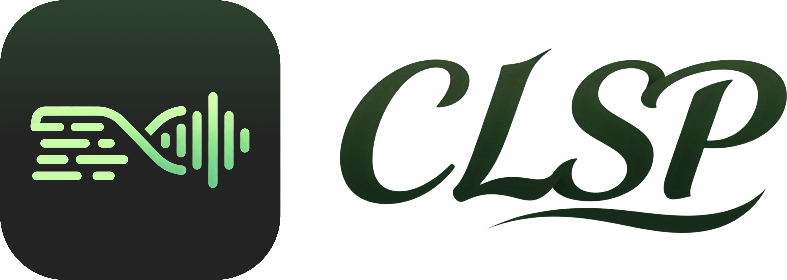

# CLSP

    

    
    

    

    

    
    
    
    
    

    Official PyTorch code for <em>Fine-Grained and Multi-Granular Contrastive Language-Speech Pre-training</em>
    

# WIP
## FCaps Dataset
🤗 Hugging Face: [Link](https://huggingface.co/datasets/yfyeung/FCaps)
